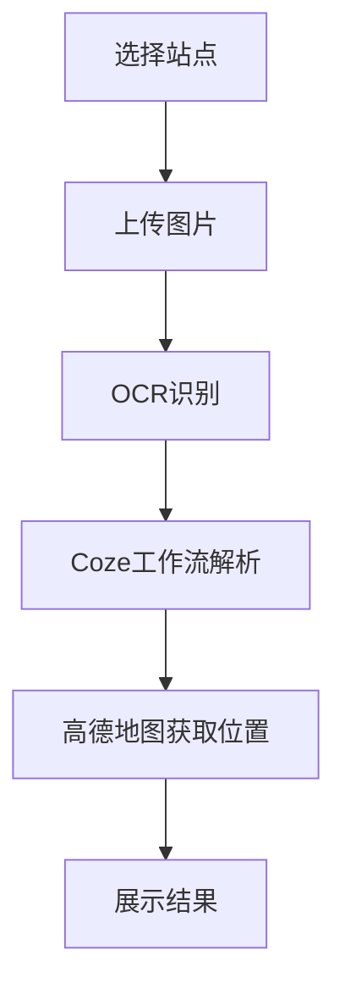

# 运输路线规划小程序业务逻辑

## 主要功能
1. 选择始发点和目标站点
2. 上传/拍摄运单图片
3. 识别运单信息
4. 展示路线和价格信息

## 数据流向


## API 调用关系

### 1. 站点位置初始化
- 调用方: `initStationLocations()`
- API: 高德地图 `getInputtips`
- 用途: 获取预设站点的经纬度信息

### 2. 图片识别
- 调用方: `recognizeImage()`
- API: 微信小程序 OCR `wx.serviceMarket.invokeService`
- 参数:
  ```json
  {
    "service": "wx79ac3de8be320b71",
    "api": "OcrAllInOne",
    "data": {
      "img_data": "base64字符串",
      "data_type": 2,
      "ocr_type": 8
    }
  }
  ```

### 3. 文本解析
- 调用方: `callCozeWorkflow()`
- API: Coze工作流 `https://api.coze.cn/v1/workflow/run`
- 参数:
  ```json
  {
    "workflow_id": "7444842047746719779",
    "parameters": {
      "BOT_USER_INPUT": "OCR识别文本"
    }
  }
  ```
- 返回: 
  ```json
  {
    "output": {
      "loading_place": "装货地址",
      "unloading_place": "卸货地址"
    }
  }
  ```

### 4. 地址解析
- 调用方: `getLocationByAddress()`
- API: 高德地图 `getInputtips`
- 用途: 获取地址的经纬度信息

### 5. 路线规划
- 调用方: `calculateRouteDistance()`
- API: 高德地图 `getDrivingRoute`
- 用途: 计算实际行驶距离

## 预设数据
- 始发站点:
  - 京东南京转运中心
  - 常州嘉民物流中心
- 目标站点:
  - 广州君建零部件产业园
  - 成都经开区南五路与车城西一路交叉口
- Mock数据:
  ```json
  {
    "pickupPrice": 180,
    "deliveryPrice": 220,
    "weight": 5,
    "cargoName": "电子设备",
    "packageType": "木箱",
    "volume": "10方",
    "truckType": "4.2米厢式货车",
    "remark": "易碎品，小心轻放"
  }
  ```

## 页面交互流程
1. 用户必须先选择始发点和目标站点
2. 选择完站点后显示上传按钮
3. 上传图片后自动进行识别
4. 识别成功后展示货物信息、提货信息和送货信息
5. 点击提货/送货卡片可查看对应路线
6. 可调整干线运输价格，自动计算总价


3-3.8米平板或箱车，车宽1.6-1.8米，可装2吨左右，6-13个方
4.2米平板或箱车或高栏，车宽2.1-2.4米，可装5吨左右，15-20方左右
6.8米平板或箱车或高栏，车宽2.4米，可装10吨左右，30-40方
9.6米平板或箱车或高栏，车宽2.4米，可装18吨，50方左右
13米平板或高栏，车宽2.4米，可装34吨，80个方
13.7-17.米平板车，车宽3米，可装33吨左右，120-180方